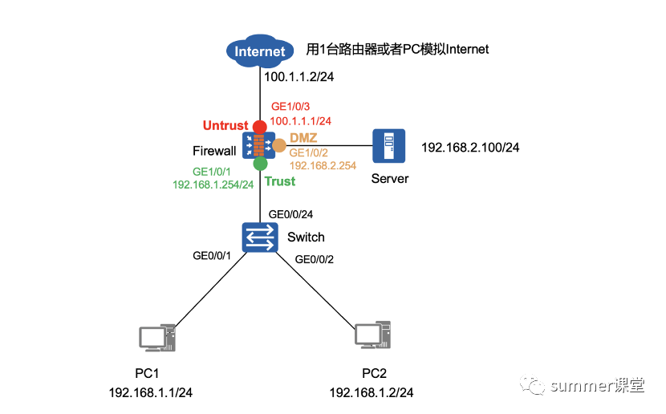

# Firewall 配置

## 网络拓扑与说明



## 配置要求

1. 防火墙接口的 IP 地址如拓扑所示，将接口划入相应的安全区域。
2. 内网主机 PC1 可以主动访问 Internet，但 Internet 无法主动访问 PC1。
3. 出口防火墙进行 NAT，NAT 公网地址池 100.1.1.10-100.1.1.20。
4. Internet 可以通过公网地址 100.1.1.100/24 访问目的地址为 192.168.2.100/24 的内部 Web 服务。

## 总结

1. 防火墙主要实现内部信任网络与公共不可信任的网络隔离，进行访问控制。【关键词：区域隔离、访问控制】
2. 部署方式
   - 防火墙：串行部署可检测所有通过防火墙的流量。旁路部署只能检测通过策略路由等方式引流通过防火墙的流量。
   - IPS：入侵防御系统，串行部署，既可以检测安全威胁，也可以阻断攻击。
   - IDS：入侵检测系统，旁路部署，能检测安全威胁，不能阻断攻击。
3. 防火墙区域与优先级，华为防火墙默认有四个安全域：信任区域、非信任区域、非军事化区域和本地区域。
   - Trust 85：用于连接内部网络
   - Untrust 5：用于连接 Internet 互联网
   - DMZ 50：用于连接对外提供访问的服务器
   - Local 100：指防火墙自身
4. 注意如下几点：
   - local、trust、DMZ、untrust 这四个是系统自带不能删除，除了这四个域之外，还可以自定义域。
   - 安全域等级 Local > Trust > DMZ > Untrust，自定义的域的优先级是可以自己调节的。
   - 域与域之间如果不做策略默认是 deny，即任何数据如果不做策略是通不过的，如果是在同一区域的就相当于二层交换机一样直接转发。
   - 优先级低的域向优先级高的域方向就是 inbound，反之就是 outbound。

## 配置

### 1. 防火墙 Firewall 配置

```shell
[Firewall] interface GigabitEthernet 1/0/1
[Firewall-GigabitEthernet0/0/1] ip address 192.168.1.254 24
[Firewall-GigabitEthernet0/0/1] quit
[Firewall] interface GigabitEthernet 1/0/2
[Firewall-GigabitEthernet0/0/2] ip address 192.168.2.254 24
[Firewall-GigabitEthernet0/0/2] quit
[Firewall] interface GigabitEthernet 1/0/3
[Firewall-GigabitEthernet0/0/3] ip address 100.1.1.1 24
[Firewall-GigabitEthernet0/0/3] quit

// 把防火墙接口加入相应安全域
[Firewall] firewall zone trust
[Firewall-zone-trust] add interface GigabitEthernet1/0/1
[Firewall-zone-trust] quit
[Firewall] firewall zone dmz
[Firewall-zone-dmz] add interface GigabitEthernet1/0/2
[Firewall-zone-dmz] quit
[Firewall] firewall zone untrust
[Firewall-zone-untrust] add interface GigabitEthernet1/0/3
[Firewall-zone-untrust] quit

// 配置安全策略，让 trust 区域（192.168.1.0/24）可以访问 Internet
[Firewall] security-policy
[Firewall-policy-security] rule name trust_to_untrust
[Firewall-policy-security-rule-trust_to_untrust] source-zone trust
[Firewall-policy-security-rule-trust_to_untrust] source-address 192.168.1.0 mask 255.255.255.0
[Firewall-policy-security-rule-trust_to_untrust] destination-zone untrust
[Firewall-policy-security-rule-policy_sec_deny1] action permit
[Firewall-policy-security-rule-policy_sec_deny1] quit

// 配置 NAT 地址池，开启端口转换。
[Firewall] nat address-group addressgroup1
[Firewall-address-group-addressgroup1] mode pat
[Firewall-address-group-addressgroup1] section 0 100.1.1.10 100.1.1.20
[Firewall-address-group-addressgroup1] quit

// 配置源 NAT 策略1，实现私网指定网段访问 Internet 时自动进行源地址转换。
[Firewall] nat-policy
[Firewall-policy-nat] rule name policy_nat1
[Firewall-policy-nat-rule-policy_nat1] source-zone trust
[Firewall-policy-nat-rule-policy_nat1] destination-zone untrust
[Firewall-policy-nat-rule-policy_nat1] source-address 192.168.1.0 24
[Firewall-policy-nat-rule-policy_nat1] destination-address any
[Firewall-policy-nat-rule-policy_nat1] action source-nat address-group addressgroup1
[Firewall-policy-nat-rule-policy_nat1] quit

// 防火墙上放行 trust 到 dmz 区域的流量。
[Firewall] security-policy
[Firewall-policy-security] rule name trust_to_dmz
[Firewall-policy-security-rule-trust_to_dmz] source-zone trust
[Firewall-policy-security-rule-trust_to_dmz] destination-zone dmz
[Firewall-policy-security-rule-trust_to_dmz] action permit
[Firewall-policy-security-rule-trust_to_dmz] quit

// 配置服务器端口映射（NAT Server）
[Firewal] security-policy
[Firewall-policy-security] rule name untrust_to_dmz
[Firewall-policy-security-rule-policy1] source-zone untrust
[Firewall-policy-security-rule-policy1] destination-zone dmz
[Firewall-policy-security-rule-policy1] destination-address 192.168.2.0 24
[Firewall-policy-security-rule-policy1] action permit
[Firewall-policy-security-rule-policy1] quit

// 配置 NAT Server 功能，把内网 Web 服务映射到公网地址。
[Firewal] nat server policy_web protocol tcp global 100.1.1.100 80 inside 192.168.2.100 80
[Firewall] display firewall session table
```

### 2. Internet 配置

```shell
[Internet] interface GigabitEthernet 0/0/0
[Internet-GigabitEthernet0/0/0] ip address 100.1.1.2 24
[Internet-GigabitEthernet0/0/0] quit
```
