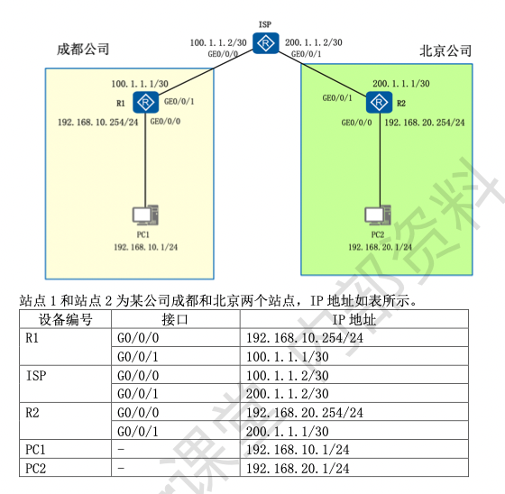
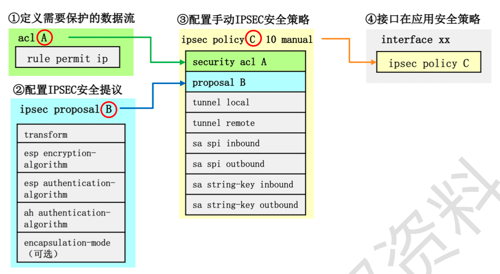
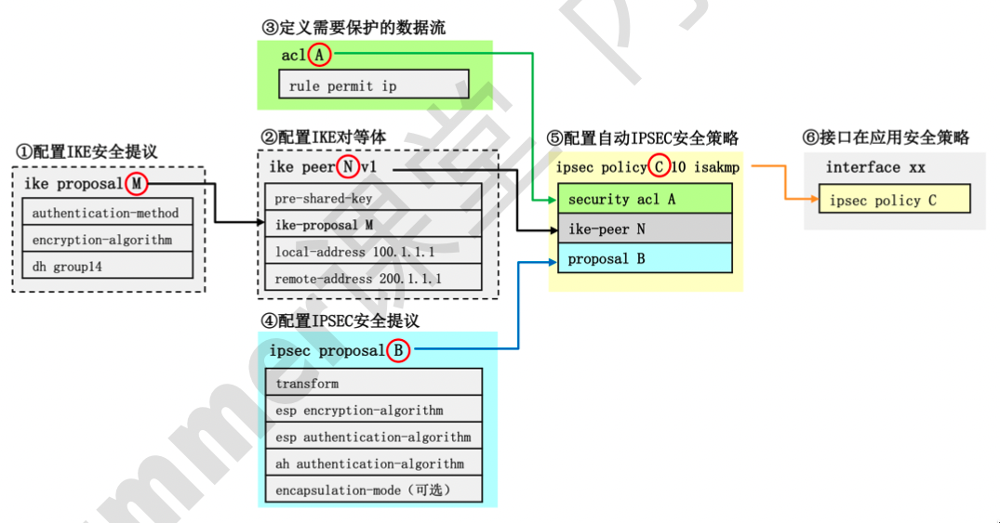

# IPSec VPN

## 网络拓扑与说明



## 实验需求

1. 成都和北京两个站点用户均可以访问互联网 2.2.2.2
2. 配置手动 IPSEC VPN，实现成都和北京两个站点内网数据互通，且数据加密。
3. 配置自动 IPSEC VPN，实现成都和北京两个站点内网数据互通，且数据加密。

## 实验步骤

1. 配置 IP 地址，ISP 路由器用 1o0 模拟互联网
2. 成都和北京两个出口路由器配置默认路由指向 ISP 路由器
3. 进行 IPSEC VPN 配置，让两个站点内网互通，同时数据加密。静态 IPSEC 配置步骤如下，一共分为四步：

   

## 配置

### 配置 IP 地址

#### R1 配置

```shell
<Huawei> system-view
[Huawei] sysname R1
[R1] interface GigabitEthernet 0/0/0
[R1-GigabitEtherneto/0/0] ip address 192.168.10.254 24
[R1-GigabitEthernet0/0/0] quit
[R1] interface GigabitEthernet 0/0/1
[R1-GigabitEthernet0/0/1] ip address 100.1.1.1 30
```

#### ISP 配置

```shell
<Huawei> system-view
[Huawei] sysname ISP
[ISP] interface GigabitEthernet 0/0/0
[ISP-GigabitEthernet0/0/0] ip address 100.1.1.2 30
[ISP-GigabitEthernet0/0/0] quit
[ISP] interface GigabitEthernet 0/0/1
[ISP-GigabitEthernet0/0/1] ip address 200.1.1.2 30
[ISP-GigabitEthernet0/0/1] quit
[ISP] interface LoopBack0
[ISP-LoopBack0] ip address 2.2.2.2 32
```

#### R2 配置

```shell
<Huawei> system-view
[Huawei] sysname R2
[R2] interface GigabitEthernet 0/0/0
[R2-GigabitEthernet0/0/0] ip address 192.168.20.254 24
[R2-GigabitEthernet0/0/0] quit
[R2] interface GigabitEthernet 0/0/1
[R2-GigabitEthernet0/0/1] ip address 200.1.1.1 30
```

### 成都和北京两个出口路由器配置默认路由指向 ISP 路由器

#### R1 配置

```shell
[R1] ac1 2000
[R1-ac1-basic-2000] rule 10 permit source 192.168.10.00.0.0.255 // 匹配源地址为 192.168.10.0/24 的流量
[R1-acl-basic-2000] quit
[R1] interface GigabitEthernet 0/0/1
[R1-GigabitEthernet0/0/1] nat outbound2000 // 出接口启用 NAT，把 ACL 2000 匹配的私网地址转换为R1 GE0/0/1接口公网 IP
[R1-GigabitEthernet0/0/1] quit
[R1]ip route-static0.0.0.0 0 100.1.1.2 // 出口路由器默认路由指向 ISP
```

#### R2 配置

```shell
[R2] ac1 2000
[R2-ac1-basic-2000] rule 10 permit source 192.168.20.00.0.0.255 // 匹配源地址为 192.168.20.0/24 的流量
[R2-acl-basic-2000] quit
[R2] interface GigabitEthernet 0/0/1
[R2-GigabitEthernet0/0/1] nat outbound2000 // 出接口启用 NAT，把 ACL 2000 匹配的私网地址转换为R2 GE0/0/1接口公网 IP
[R2-GigabitEthernet0/0/1] quit
[R2]ip route-static0.0.0.0 0 200.1.1.2 // 出口路由器默认路由指向 ISP
```

### 进行 IPSEC VPN 配置，让两个站点内网互通，同时数据加密。

#### R1 配置

```shell
// 第一步：匹配感兴趣的流量
[R1] acl3000
[R1-acl-adv-3000] rule 10 permit ip source 192. 168. 10.0 0.0.0.255 destination 192.168.20.00.0.0.255

// 第二步：配置 ipsec 提议
[R1] ipsec proposal cd // ipsec 提议名称 cd
[R1-ipsec-proposal-cd] esp authentication-algorithm sha2-256 // 认证算法采用 sha2-256
[R1-ipsec-proposal-cd] esp encryption-algorithm aes-128 // 加密算法采用 aes-128

// 第三步：配置 ipsec 手动方式安全策略
[R1] ipsec policy chengdu10 manual // 配置 IPSEC 策略 chegndu，方式为手动
[R1-ipsec-policy-manual-chengdu-10] security acl 3000 // 包含 acl3000 的流量
[R1-ipsec-policy-manual-chengdu-10] proposal cd // 采用 ipsec 提议 cd
[R1-ipsec-po1icy-manual-chengdu-10] tunnel local 100.1.1.1 // 配置隧道本地地址 100.1.1.1
[R1-ipsec-policy-manual-chengdu-10] tunnel remote 200.1.1.1 // 配置隧道远端地址 200.1.1.1
[R1-ipsec-po1icy-manual-chengdu-10] sa spi inbound esp 54321 // 配置入方向 SA 编号 54321
[R1-ipsec-policy-manual-chengdu-l0] sa string-key inbound esp cipher abc123 // 配置入方向 SA 的认证密钥为 abc123
[R1-ipsec-po1icy-manual-chengdu-10] sa spi outbound esp12345 // 配置出方向 SA 编号 54321
[R1-ipsec-policy-manual-chengdu-l0] sa string-key outbound esp cipher abc123 // 配置出方向 SA 的认证密钥为 abc123

// 第四步：在接口上应用 ipsec 策略
[R1] interface GigabitEthernet 0/0/1
[R1-GigabitEthernet0/0/l] ipsec policy chengdu // 接口上应用 ipsce 策略（只能用于出接口）
[R1] display ipsec sa brief // 查看 IPSEC SA

// R1 进行如下调整，在 NAT 地址池中排除需要进行 VPN 传送的流量。
[R1] interface GigabitEthernet 0/0/1
[R1-GigabitEthernet0/0/1] undo nat outbound2000 // 删除NAT在接口上的应用
[R1-GigabitEthernet0/0/1] quit
[R1] undo acl 2000 // 删除ACL 2000
[R1] ac1 3001
[R1-acl-adv-3001] rule 10 deny ip source 192.168.10.0 0.0.0.255 destination 192.168.20.0 0.0.0.255
[R1-acl-adv-3001] rule 20 permit ip // 其他流量全部允许
[R1-acl-adv-3001] quit
[R1] interface GigabitEthernet 0/0/1
[R1-GigabitEthernet0/0/1] nat outbound 3001 // 重新配置NAT转换
```

```shell
// R2 进行如下调整，在 NAT 地址池中排除需要进行 VPN 传送的流量。
[R2] interface GigabitEthernet 0/0/1
[R2-GigabitEthernet0/0/1] undo nat outbound2000 // 删除NAT在接口上的应用
[R2-GigabitEthernet0/0/1] quit
[R2] undo acl 2000 // 删除ACL 2000
[R2] ac1 3001
[R2-acl-adv-3001] rule 10 deny ip source 192.168.20.0 0.0.0.255 destination 192.168.10.0 0.0.0.255
[R2-acl-adv-3001] rule 20 permit ip // 其他流量全部允许
[R2-acl-adv-3001] quit
[R2] interface GigabitEthernet 0/0/1
[R2-GigabitEthernet0/0/1] nat outbound 3001 // 重新配置NAT转换
```

### 通过 IKE 动态建立 IPSEC VPN 隧道



#### R1 配置

```shell
[R1] undo ipsec policy chengdu // 删除 ipsec 策略 chengdu

// 第一步：配置 IKE 提议
[R1] ike proposal10 // ike 提议编号 10
[R1-ike-proposal-l0] authentication-algorithm sha1 // 配置认证算法 sha1
[R1-ike-proposal-10] encryption-algorithm aes-cbc-128 // 配置加密算法 aes-cbc-128
[R1-ike-proposal-10] dh group14 // 密钥交换协议采用 DH，group14 表示 2014 bit DH 交换组

// 第二步：配置 ike 对等体
[R1] ike peer bj v1 // ike 对等体为 bj，采用 ike v1 协商对等体
[R1-ike-peer-bj] pre-shared-key cipher abc123 // 配置预共享密钥 abc123
[R1-ike-peer-bj] ike-proposal 10 // ike 提议编号 10
[R1-ike-peer-bj] local-address 100.1.1.1 // 本地地址 100.1.1.1
[R1-ike-peer-bj] remote-address 200.1.1.1 // 远端地址 200.1.1.1
[R1-ike-peer-bj] quit

// 第三步：定义需要保护的数据流

// 第四步：配置 ipsec 提议内部资料
[R1] ipsec proposal cd // ipsec 提议名称 cd
[R1-ipsec-proposal-cd] esp authentication-algorithm sha2-256 // 认证算法采用 sha2-256
[R1-ipsec-proposal-cd] esp encryption-algorithm aes-128 // 加密算法采用 aes-128

// 第五步：配置 ipsec 策略
[R1]ipsec policy chengdu 10 isakmp // 配置 ipsec 策略 chengdu,编号 10，isakmp 表示自动隧道
[R1-ipsec-policy-isakmp-chengdu-10] security acl3000 / /保护 ACL3000 匹配的流量
[R1-ipsec-policy-isakmp-chengdu-l0] ike-peer bj // ike 对等体是 bj
[R1-ipsec-policy-isakmp-chengdu-l0] proposal cd // 采用 ipsec 提议 cd
[R1-ipsec-policy-isakmp-chengdu-10] quit

// 第六步：接口下应用安全策略
[R1] interface GigabitEthernet0/0/1
[R1-GigabitEthernet0/0/l] ipsec policy chengdu // 应用 ipsec 策略 chengdu
[R1-GigabitEthernet0/0/1] quit
```
