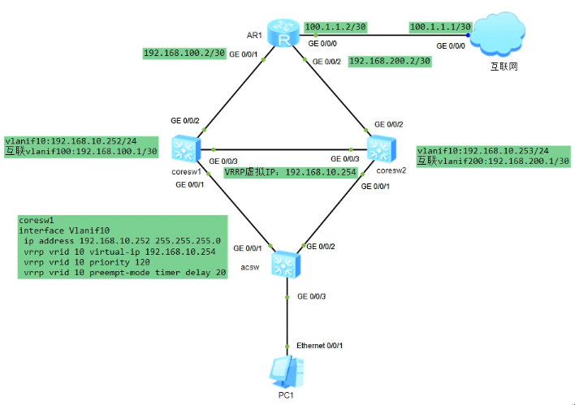

# VRRP 配置

## 网络拓扑与说明



## 配置

### 1. 接入交换机 acsw 配置（vlan）

```shell
<Huawei> system-view
[Huawei] sysname acsw

[acsw] vlan batch 10
[acsw] interface GigabitEthernet 0/0/1
[acsw-GigabitEthernet0/0/1] port link-type trunk
[acsw-GigabitEthernet0/0/1] port trunk allow-pass vlan all
[acsw-GigabitEthernet0/0/1] quit
[acsw] interface GigabitEthernet 0/0/2
[acsw-GigabitEthernet0/0/2] port link-type trunk
[acsw-GigabitEthernet0/0/2] port trunk allow-pass vlan all
[acsw-GigabitEthernet0/0/2] quit
[acsw] interface GigabitEthernet 0/0/3
[acsw-GigabitEthernet0/0/3] port link-type access
[acsw-GigabitEthernet0/0/3] port default vlan 10
[acsw-GigabitEthernet0/0/3] quit
```

### 2. 核心交换机 coresw1 配置

```shell
<Huawei> system-view
[Huawei] sysname coresw1

[coresw1] vlan batch 10 100
[coresw1] interface GigabitEthernet 0/0/2
[coresw1-GigabitEthernet0/0/2] port link-type access
[coresw1-GigabitEthernet0/0/2] port default vlan 100
[coresw1-GigabitEthernet0/0/2] quit
[coresw1] interface GigabitEthernet 0/0/1
[coresw1-GigabitEthernet0/0/1] port link-type trunk
[coresw1-GigabitEthernet0/0/1] port trunk allow-pass vlan all
[coresw1-GigabitEthernet0/0/1] quit
[coresw1] interface GigabitEthernet 0/0/3
[coresw1-GigabitEthernet0/0/3] port link-type trunk
[coresw1-GigabitEthernet0/0/3] port trunk allow-pass vlan all
[coresw1-GigabitEthernet0/0/3] quit

[coresw1] interface Vlanif 10
[coresw1-Vlanif10] ip address 192.168.10.252 24
[coresw1-Vlanif10] quit
[coresw1] interface Vlanif 100
[coresw1-Vlanif100] ip address 192.168.100.1 30
[coresw1-Vlanif100] quit

[coresw1] ip route-static 0.0.0.0 0 192.168.100.2

// VRRP Master
[coresw1] interface Vlanif 10
[coresw1-Vlanif10] vrrp vrid 10 virtual-ip 192.168.10.254
[coresw1-Vlanif10] vrrp vrid 10 priority 120
[coresw1-Vlanif10] vrrp vrid 10 preempt-mode timer delay 20
[coresw1-Vlanif10] quit
```

### 2. 核心交换机 coresw2 配置

```shell
<Huawei> system-view
[Huawei] sysname coresw2

[coresw2] vlan batch 10 200
[coresw2] interface GigabitEthernet 0/0/2
[coresw2-GigabitEthernet0/0/2] port link-type access
[coresw2-GigabitEthernet0/0/2] port default vlan 200
[coresw2-GigabitEthernet0/0/2] quit
[coresw2] interface GigabitEthernet 0/0/1
[coresw2-GigabitEthernet0/0/1] port link-type trunk
[coresw2-GigabitEthernet0/0/1] port trunk allow-pass vlan all
[coresw2-GigabitEthernet0/0/1] quit
[coresw2] interface GigabitEthernet 0/0/3
[coresw2-GigabitEthernet0/0/3] port link-type trunk
[coresw2-GigabitEthernet0/0/3] port trunk allow-pass vlan all
[coresw2-GigabitEthernet0/0/3] quit

[coresw2] interface Vlanif 10
[coresw2-Vlanif10] ip address 192.168.10.253 24
[coresw2-Vlanif10] quit
[coresw2] interface Vlanif 200
[coresw2-Vlanif200] ip address 192.168.200.1 30
[coresw2-Vlanif200] quit

[coresw2] ip route-static 0.0.0.0 0 192.168.200.2

// VRRP Backup
[coresw2] interface Vlanif 10
[coresw2-Vlanif10] vrrp vrid 10 virtual-ip 192.168.10.254
[coresw2-Vlanif10] vrrp vrid 10 priority 100 // 默认 100
[coresw2-Vlanif10] quit
```

### 3. 出口路由 router 配置

```shell
<Huawei> system-view
[Huawei] sysname router

[router] interface GigabitEthernet 0/0/0
[router-GigabitEthernet0/0/0] ip address 100.1.1.2 30
[router-GigabitEthernet0/0/0] quit
[router] interface GigabitEthernet 0/0/1
[router-GigabitEthernet0/0/1] ip address 192.168.100.2 30
[router-GigabitEthernet0/0/1] quit
[router] interface GigabitEthernet 0/0/2
[router-GigabitEthernet0/0/2] ip address 192.168.200.2 30
[router-GigabitEthernet0/0/2] quit

[router] ip router-static 0.0.0.0 0 100.1.1.1
[router] ip router-static 192.168.10.0 24 192.168.100.1
[router] ip router-static 192.168.10.0 24 192.168.200.1
```

### 4. internet 配置

```shell
[internet] ip router-static 0.0.0.0 0 100.1.1.2
```
