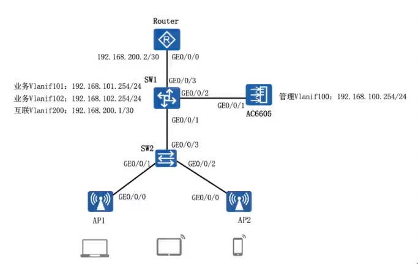

# 无线 WLAN 配置



## 需求描述

1. 配置隧道转发模式，完成 AP 上线，内部办公用户 (VLAN101) 能通过无线上网。
2. 访客 (VLAN102) 能通过无线上网，修改为直接转发模式。
3. 管理 VLAN100，业务 VLAN101 和 VLAN102，VLAN101 为内部用户提供上网服务 (SSID: wifi_work)，VLAN1O2 为访客提供上网服务 (SSID: wifi_guest)。
4. AP 通过 AC DHCP 自动获取 IP 192.168.100.0/24 地址段的地址，用户通过 SW1 DHCP 自动分配对应网段的地址。

## 一、配置 SW1（VLAN、Vlanif、DHCP）

### SW1 - VLAN 配置

```shell
<Huawei> system-view
[Huawei] sysname SW1
[SW1] vlan batch 100 101 102 200
[SW1] interface Gigabitethernet 0/0/3
[SW1-GigabitEthernet0/0/3] port link-type access // 与互联网连接
[SW1-GigabitEthernet0/0/3] port default vlan 200 // 互联网 200
[SW1-GigabitEthernet0/0/3] quit
[SW1] interface Gigabitethernet 0/0/2
[SW1-GigabitEthernet0/0/2] port link-type trunk // 与 AC 连接
[SW1-GigabitEthernet0/0/2] port trunk allow-pass vlan all // 允许全部 vlan 通过
[SW1-GigabitEthernet0/0/2] quit
[SW1] interface Gigabitethernet 0/0/1
[SW1-GigabitEthernet0/0/1] port link-type trunk // 与 SW2 连接
[SW1-GigabitEthernet0/0/1] port trunk allow-pass vlan 100 101 102 // 隧道模式只允许 100；直接转发模式允许 100 101 102
[SW1-GigabitEthernet0/0/1] quit
```

### SW1 - 接口 Vlanif 配置

```shell
[SW1] interface Vlanif 101
[SW1-Vlanif101] ip address 192.168.101.254 24
[SW1-Vlanif101] quit
[SW1] interface Vlanif 102
[SW1-Vlanif102] ip address 192.168.102.254 24
[SW1-Vlanif102] quit
[SW1] interface Vlanif 200
[SW1-Vlanif200] ip address 192.168.200.1 24
[SW1-Vlanif200] quit
```

### SW1 - DHCP 配置（接口方式和全局地址池方式）

```shell
[SW1] dhcp enable // 开启 DHCP 功能
[SW1] interface Vlanif 101 // 进入 vlanif 接口选择 DHCP 方式
[SW1-Vlanif101] dhcp select interface // 接口 DHCP，接口的 IP 就是网关
[SW1-Vlanif101] dhcp server dns-list 8.8.8.8
[SW1-Vlanif101] dhcp server excluded-ip-address 192.168.101.101 192.168.101.253
[SW1-Vlanif101] dhcp server lease 10
[SW1-Vlanif101] quit
[SW1] ip pool 102 // 系统视图下创建 IP 地址池 102
[SW1-ip-pool-102] network 192.168.102.0 mask 255.255.255.0 // 配置地址池范围
[SW1-ip-pool-102] gateway-list 192.168.102.254 // 网关
[SW1-ip-pool-102] dns-list 8.8.8.8
[SW1-ip-pool-102] excluded-ip-address 192.168.102.101 192.168.102.253
[SW1-ip-pool-102] lease 10
[SW1-ip-pool-102] quit
[SW1] interface Vlanif 102 // 进入 vlanif 接口选择 DHCP 方式
[SW1-Vlanif102] dhcp select global // 全局地址池 DHCP
[SW1-Vlanif102] quit
```

## 二、配置 SW2（VLAN）

### SW2 - VLAN 配置

```shell
<Huawei> system-view
[Huawei] sysname SW2
[SW2] vlan batch 100 101 102 // 隧道模式需要 vlan 100；直接转发模式需要 vlan batch 101 102
[SW2] interface Gigabitethernet 0/0/1
[SW2-GigabitEthernet0/0/1] port link-type trunk // 与 AP1 连接（隧道模式）
[SW2-GigabitEthernet0/0/2] port trunk pvid vlan 100 // 隧道模式打标签，数据都会被 vlan 100 封装
[SW2-GigabitEthernet0/0/1] port trunk allow-pass vlan 100 // 隧道模式只允许 100
[SW2-GigabitEthernet0/0/1] quit
[SW2] interface Gigabitethernet 0/0/2
[SW2-GigabitEthernet0/0/2] port link-type trunk // 与 AP2 连接（直接转发）
[SW2-GigabitEthernet0/0/2] port trunk allow-pass vlan 100 101 102 // 直接转发模式允许 100 101 102
[SW2-GigabitEthernet0/0/2] quit
[SW2] interface Gigabitethernet 0/0/3
[SW2-GigabitEthernet0/0/3] port link-type trunk // 与 SW1 连接
[SW2-GigabitEthernet0/0/3] port trunk allow-pass vlan 100 101 102 // 隧道模式只允许 100；直接转发模式允许 100 101 102
[SW2-GigabitEthernet0/0/3] quit

```

## 三、配置 Router（IP、静态路由）

### Router - IP 地址配置

```shell
<Huawei> system-view
[Huawei] sysname Router
[Router] interface Gigabitethernet 0/0/0
[Router-GigabitEthernet0/0/0] ip address 192.168.200.2 30
[Router-GigabitEthernet0/0/0] quit
```

### Router - 内网静态路由配置

```shell
[Router] ip route-static 192.168.101.0 24 192.168.200.1 // 处理内网 101 网段，下一跳为 SW1 的 200 网关
[Router] ip route-static 192.168.102.0 24 192.168.200.1 // 处理内网 102 网段，下一跳为 SW1 的 200 网关
```

## 四、配置 AC

### AC - 基础配置（VLAN、IP、DHCP）

```shell
<AC6605> system-view
[AC6605] vlan batch 100 101 102
[AC6605] interface GigabitEthernet 0/0/1
[AC6605-GigabitEthernet0/0/1] port link-type trunk
[AC6605-GigabitEthernet0/0/1] port trunk allow-pass vlan all
[AC6605-GigabitEthernet0/0/1] quit
[AC6605] dhcp enable
[AC6605] interface Vlanif 100
[AC6605-Vlanif100] ip address 192.168.100.254 24
[AC6605-Vlanif100] dhcp select interface // 为 AP 分配与 Vlanif 100 相同网段的管理地址
[AC6605-Vlanif100] quit
```

### AC - 在 AC 上配置 AP 上线

#### 1. 创建域管理模版，并配置国家代码

```shell
[AC6605] wlan
[AC6605-wlan-view] regulatory-domain-profile name domain_temp // 新增域管理模版名称 domain_temp
[AC6605-wlan-regulatory-domain-domain_temp] country-code cn // 配置国家代码 cn
[AC6605-wlan-regulatory-domain-domain_temp] quit
```

#### 2. 创建 AP 组，并引用特定的域管理模版

```shell
[AC6605-wlan-view] ap-group name ap_temp // 新增 AP 组名称 ap_temp
[AC6605-wlan-ap-group-ap_temp] regulatory-domian-profile domain_temp // 引用域管理模版 domain_temp
[AC6605-wlan-ap-group-ap_temp] quit
[AC6605-wlan-view] quit
```

#### 3. 配置 CAPWAP 隧道源接口或者源地址

```shell
[AC6605] capwap source interface Vlanif 100 // 配置 CAPWAP 隧道源接口 Vlanif 100
```

#### 4. 配置 AP 设备入网认证

上线认证三种方式：mac-auth、no-auth、sn-auth

查看某个设备的 MAC 地址：display interface GigabitEthernet0/0/0

##### 在 AC 上配置 AP1

```shell
[AC6605] wlan
[AC6605-wlan-view] ap auth-mode mac-auth // 配置 AP 上线认证方式为 MAC 地址认证
[AC6605-wlan-view] ap-id 1 ap-mac 00e0-fcd6-2df0 // 配置 AP1 的 MAC 地址
[AC6605-wlan-ap-1] ap-name VLAN101-001 // 把 AP1 命名为 VLAN101-001（AP1 设备会被重命名）
[AC6605-wlan-ap-1] ap-group ap_temp // 配置 AP1 在 AP 组 ap_temp 中
```

##### 在 AC 上配置 AP2

```shell
[AC6605] wlan
[AC6605-wlan-view] ap auth-mode mac-auth
[AC6605-wlan-view] ap-id 2 ap-mac 00e0-fc3f-7500
[AC6605-wlan-ap-2] ap-name VLAN101-002
[AC6605-wlan-ap-2] ap-group ap_temp
```

#### 5. 检查 AP 上线结果

```shell
[AC6605] display ap al1 // 查看 AP 的上线情况，状态为 nor 表示正常的
```

### AC - 无线控制器 WLAN 业务配置，配置完成后会自动下发到对应 AP

#### 1. 配置 security-profile

```shell
[AC6605] wlan
[AC6605-wlan-view] security-profile name security_temp // 新增 security 模版名称 security_temp
[AC6605-wlan-security-prof-security_temp] security wpa-wpa2 psk pass-phrase a1234567 aes // 密码认证
[AC6605-wlan-security-prof-security_temp] quit
```

#### 2. 配置 ssid-profile

##### Work: ssid wifi_work

```shell
[AC6605-wlan-view] ssid-profile name ssid_temp_work // 新增 SSID 模版名称 ssid_temp_work
[AC6605-wlan-ssid_prof-ssid_temp_work] ssid wifi_work // SSID 名称 wifi_work
[AC6605-wlan-ssid_prof-ssid_temp_work] quit
```

##### Guest: ssid wifi_guest

```shell
[AC6605-wlan-view] ssid-profile name ssid_temp_guest // 新增 SSID 模版名称 ssid_temp_guest
[AC6605-wlan-ssid_prof-ssid_temp_guest] ssid wifi_guest // SSID 名称 wifi_guest
[AC6605-wlan-ssid_prof-ssid_temp_guest] quit
```

#### 3. 配置 vap-profile

##### Work: forward-mode tunnel 隧道模式

```shell
[AC6605-wlan-view] vap-profile name vap_temp_work // 配置 VAP 模版名称 vap_temp_work
[AC6605-wlan-vap_prof-vap_temp_work] forward-mode tunnel // 转发模式为隧道模式
[AC6605-wlan-vap_prof-vap_temp_work] service-vlan vlan-id 101 // 连接 vap_temp_work 的用户被划分到 VLAN 101
[AC6605-wlan-vap_prof-vap_temp_work] security-profile security_temp // 将 security_temp 模版绑定到 vap_temp_work
[AC6605-wlan-vap_prof-vap_temp_work] ssid-profile ssid_temp_work // 将 ssid_temp_work 模版绑定到 vap_temp_work
```

##### Guest: forward-mode direct-forward 直接转发

```shell
[AC6605-wlan-view] vap-profile name vap_temp_guest // 配置 VAP 模版名称 vap_temp_guest
[AC6605-wlan-vap_prof-vap_temp_guest] forward-mode direct-forward // 转发模式为直接转发
[AC6605-wlan-vap_prof-vap_temp_guest] service-vlan vlan-id 102 // 连接 vap_temp_guest 的用户被划分到 VLAN 102
[AC6605-wlan-vap_prof-vap_temp_guest] security-profile security_temp // 将 security_temp 模版绑定到 vap_temp_guest
[AC6605-wlan-vap_prof-vap_temp_guest] ssid-profile ssid_temp_guest // 将 ssid_temp_guest 模版绑定到 vap_temp_guest
```

#### 4. 在 ap-group 中绑定 vap-profile

##### Work: vap-profile vap_temp_work

```shell
[AC6605-wlan-view] ap-group name ap_temp
[AC6605-wlan-ap-group-ap_temp] vap-profile vap_temp_work wlan 1 radio 0 // 2.4G
[AC6605-wlan-ap-group-ap_temp] vap-profile vap_temp_work wlan 1 radio 1 // 5G
[AC6605-wlan-ap-group-ap_temp] quit
```

##### Guest: vap-profile vap_temp_guest

```shell
[AC6605-wlan-view] ap-group name ap_temp
[AC6605-wlan-ap-group-ap_temp] vap-profile vap_temp_guest wlan 2 radio 0
[AC6605-wlan-ap-group-ap_temp] vap-profile vap_temp_guest wlan 2 radio 1
[AC6605-wlan-ap-group-ap_temp] quit
```
