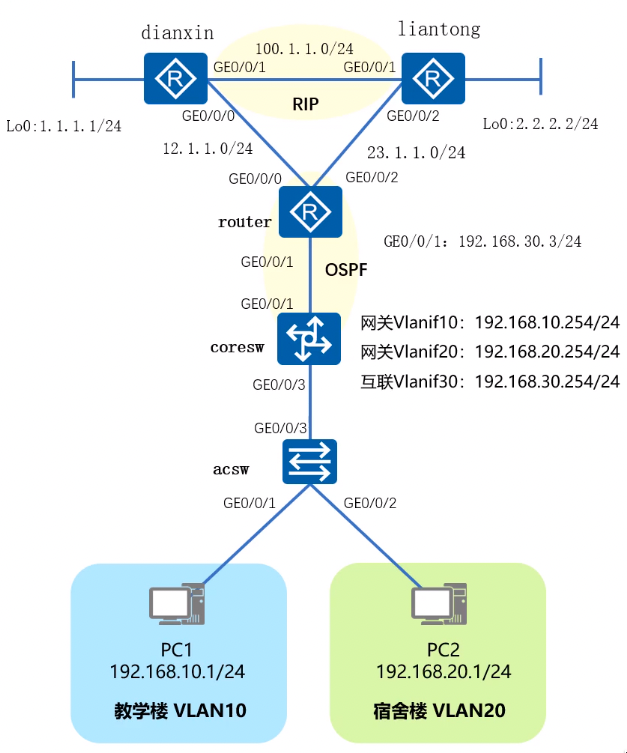

# 综合实验

## 网络拓扑与说明



1. 理解网络拓扑与组网架构。
2. VLAN 配置与 IP 地址配置，跨 VLAN 通信。
3. DHCP 配置：全局、接口
   - 场景 1：VLAN 10 基于全局 DHCP
   - 场景 2：VLAN 20 基于接口 DHCP
4. 路由配置：静态、默认、RIP/OSPF。
   - 场景 1：核心交换机默认路由指向出口路由器，出口路由器回指静态路由。
   - 场景 2：核心交换机与出口路由器之间运行 RIPv2。
   - 场景 3：核心交换机与出口路由器之间运行 OSPF。
5. ACL 配置，NAT 配置，策略路由配置。
   - 场景 1：所有流量默认走电信，如果电信出现故障，流量切换到联通。
   - 场景 2：教学楼走电信出口，宿舍楼走联通出口。
   - 场景 3：访问电信的服务器走电信出口，访问联通服务器走联通出口。

## 基本步骤配置

1. 内网配置：VLAN、Vlanif、DHCP
2. 骨干配置：静态默认路由、RIP、OSPF
3. 网络出口：NAT、策略路由

## 配置

### 接入交换机 acsw 配置（vlan）

```shell
<Huawei> system-view
[Huawei] sysname acsw

[acsw] vlan batch 10 20
[acsw] interface GigabitEthernet 0/0/1
[acsw-GigabitEthernet0/0/1] port link-type access
[acsw-GigabitEthernet0/0/1] port default vlan 10
[acsw-GigabitEthernet0/0/1] quit
[acsw] interface GigabitEthernet 0/0/2
[acsw-GigabitEthernet0/0/2] port link-type access
[acsw-GigabitEthernet0/0/2] port default vlan 20
[acsw-GigabitEthernet0/0/2] quit
[acsw] interface GigabitEthernet 0/0/3
[acsw-GigabitEthernet0/0/3] port link-type trunk
[acsw-GigabitEthernet0/0/3] port trunk allow-pass vlan all
[acsw-GigabitEthernet0/0/3] quit
```

### 核心交换机 coresw 配置（vlan、vlanif、ip、dhcp、rip、ospf）

```shell
<Huawei> system-view
[Huawei] sysname coresw

[coresw] vlan batch 10 20 30
[coresw] interface GigabitEthernet 0/0/1
[coresw-GigabitEthernet0/0/1] port link-type access
[coresw-GigabitEthernet0/0/1] port default vlan 30
[coresw-GigabitEthernet0/0/1] quit
[coresw] interface GigabitEthernet 0/0/3
[coresw-GigabitEthernet0/0/3] port link-type trunk
[coresw-GigabitEthernet0/0/3] port trunk allow-pass vlan all

[coresw] dhcp enable
[coresw] ip pool 10
[coresw-ip-pool-10] network 192.168.10.0 mask 255.255.255.0
[coresw-ip-pool-10] gateway-list 192.168.10.254
[coresw-ip-pool-10] dns-list 8.8.8.8
[coresw-ip-pool-10] excluded-ip-address 192.168.10.101 192.168.10.253
[coresw-ip-pool-10] lease 10
[coresw-ip-pool-10] quit

[coresw] interface Vlanif 10
[coresw-Vlanif10] ip address 192.168.10.254 24
[coresw-Vlanif10] dhcp select global
[coresw-Vlanif10] quit
[coresw] interface Vlanif 20
[coresw-Vlanif20] ip address 192.168.20.254 24
[coresw-Vlanif20] dhcp select interface
[coresw-Vlanif20] quit
[coresw] interface Vlanif 30
[coresw-Vlanif30] ip address 192.168.30.254 24
[coresw-Vlanif30] quit

[coresw] ip router-static 0.0.0.0 0 192.168.30.3 // 核心交换机默认路由指向出口路由
[coresw] display ip routing-table

[coresw] rip 1
[coresw-rip-1] version 2
[coresw-rip-1] network 192.168.10.0
[coresw-rip-1] network 192.168.20.0
[coresw-rip-1] network 192.168.30.0
[coresw-rip-1] quit

[coresw] undo rip 1 // 取消 rip 配置，改为 ospf
[coresw] ospf 1 router-id 192.168.30.254 // 启动 ospf，并配置 router-id
[coresw-ospf-1] area 0
[coresw-ospf-1] network 192.168.10.0 0.0.0.255 // ospf 使用反掩码
[coresw-ospf-1] network 192.168.20.0 0.0.0.255
[coresw-ospf-1] network 192.168.30.0 0.0.0.255
[coresw-ospf-1] quit
```

### 出口路由 router 配置（ip、rip、ospf、router-static、router-default）

```shell
<Huawei> system-view
[Huawei] sysname router

[router] interface GigabitEthernet 0/0/1
[router-GigabitEthernet0/0/1] ip address 192.168.30.3 24
[router-GigabitEthernet0/0/1] quit
[router] ip router-static 192.168.10.0 24 192.168.30.254 // 内网 10 段指向核心交换机
[router] ip router-static 192.168.20.0 24 192.168.30.254 // 内网 20 段指向核心交换机
[router] display ip routing-table

[router] rip 1
[router-rip-1] version 2
[router-rip-1] network 192.168.30.0
[router-rip-1] quit

[router] undo rip 1 // 取消 rip 配置，改为 ospf
[router] ospf 1 router-id 192.168.30.3 // 启动 ospf，并配置 router-id
[router-ospf-1] area 0
[router-ospf-1] network 192.168.30.0 0.0.0.255 // ospf 使用反掩码
[router-ospf-1] quit

// 所有流量默认走电信，如果电信出现故障，流量切换到联通。
[router] acl number 3000
[router-acl-adv-3000] rule 5 permit ip source 192.168.10.0 0.0.0.255 // acl 使用反掩码
[router-acl-adv-3000] rule 10 permit ip source 192.168.20.0 0.0.0.255 // acl 使用反掩码
[router-acl-adv-3000] quit
```
