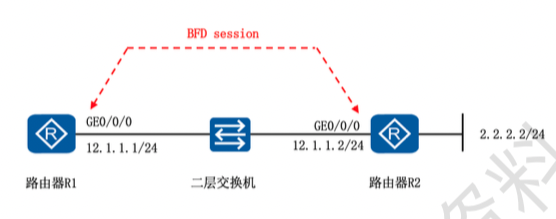
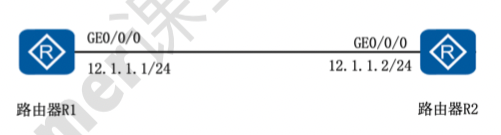

# 网络质量探测

## 网络拓扑



## 配置

### 一、BFD 监测网络状态

1. BFD 用于快速检测系统设备之间的发送和接受两个方向的通信故障，并在出现故障时通知生成应用。
2. BFD 广泛用于链路故障检测，并能实现与接口、静态路由、动态路由等联动检测。
3. BFD 协议使用的默认组播地址是 224.0.0.184。

#### 1. 路由器 R1 配置

```shell
[R1] interface GigabitEthernet0/0/0
[R1-GigabitEthernet0/0/0] ip address 12.1.1.1 24
[R1-GigabitEthernet0/0/0] quit

[R1] bfd # 开启 BFD
[R1-bfd] quit
```

#### 2. 路由器 R2 配置

```shell
[R2] interface GigabitEthernet0/0/0
[R2-GigabitEthernet0/0/0] ip address 12.1.1.2 24
[R2-GigabitEthernet0/0/0] quit

[R2] bfd # 开启 BFD
[R2-bfd] quit
[R2] bfd bfd_r1r2 bind peer-ip 12.1.1.1 source-ip 12.1.1.2 auto # 和 R1 相反
[R2-bfd-session-bfd_r1r2] commit # 使用 commit 关键字使 BFD 生效
[R2-bfd-session-bfd_r1r2] quit
```

#### 3. 路由器 R1 和 R2 之间的 BFD session

```shell
[R1] bfd bfd_r1r2 bind peer-ip 12.1.1.2 source-ip 12.1.1.1 auto # 单臂回声 one-arm-echo
[R1-bfd-session-bfd_r1r2] discriminator local 11 # 本地标识符
[R1-bfd-session-bfd_r1r2] discriminator remote 22 # 远端标识符
[R1-bfd-session-bfd_r1r2] min-tx-interval 100 # 最小报文发送间隔
[R1-bfd-session-bfd_r1r2] min-rx-interval 100 # 最小报文接收间隔
[R1-bfd-session-bfd_r1r2] wtr 1 # 主路由链路 UP 后等待 1min 后再恢复，防止抖动，默认是 0
[R1-bfd-session-bfd_r1r2] commit # 使用 commit 关键字使 BFD 生效
[R1-bfd-session-bfd_r1r2] quit

> 配置静态路由跟踪 BFD 状态，实现链路故障时路由自动切换。

[R1] ip router-static 0.0.0.0 0 12.1.1.2 track bfd-session bfd_r1r2 # 默认路由上跟踪 bfd-session bfd_r1r2，主链路故障时自动切换
[R1] ip router-static 2.2.2.0 24 12.1.1.2 track bfd-session bfd_r1r2 # 配置静态路由跟踪 bfd_r1r2，目标网段链路故障时自动切换

[R1] display bfd session all # 查看 bfd 状态，确认 BFD 会话是否正常
```

### 二、NQA 监测网络状态



#### 路由器 R1 配置

> 配置 NQA 测试实例，实现链路质量探测和静态路由联动。

```shell
[R1] interface GigabitEthernet0/0/0
[R1-GigabitEthernet0/0/0] ip address 12.1.1.1 24 # 配置接口 IP
[R1-GigabitEthernet0/0/0] quit

[R1] nqa test-instance root icmp # 创建一个 nqa 测试实例 icmp，测试管理账户名为 root
[R1-nqa-root-icmp] test-type icmp # 测试类型为 icmp 协议测试
[R1-nqa-root-icmp] frequency 10 # 指定连续两次探测时间间隔为 10s
[R1-nqa-root-icmp] probe-count 2 # 指定一次探测进行的测试次数
[R1-nqa-root-icmp] destination-address ipv4 12.1.1.2 # 设置探测目标地址
[R1-nqa-root-icmp] start now # 启动当前测试实例，立即开始探测
[R1-nqa-root-icmp] quit

[R1] ip router-static 0.0.0.0 0 12.1.1.2 track nqa root icmp # 默认路由上跟踪 nqa root icmp，链路异常时自动切换
[R1] display nqa results test-instance root icmp # 查看 nqa 状态，确认探测结果
```

#### 路由器 R2 配置

> 配置 R2 接口 IP 地址，作为 NQA/BFD 探测目标。

```shell
[R2] interface GigabitEthernet0/0/0
[R2-GigabitEthernet0/0/0] ip address 12.1.1.2 24 # 配置接口 IP
[R2-GigabitEthernet0/0/0] quit
```
