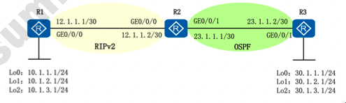

# 路由策略

## 网络拓扑与说明



## 实验需求

1. 让 R3 可以学到 10.1.2.0/24 和 10.1.1.3.0/24 路由，不能学到 10.1.1.0/24。
2. 让 R2 向 R1 通告 R3 的三个环回接口，cost 设置为 10。

## 实验步骤:

1. 配置 IP 地址
2. 配置 RIP 和 OSPF
3. R2 上配置路由引入和路由策略，进行路由过滤和 cost 设置。
4. 验证测试

## 配置

### R1 配置

```shell
[R1] rip 1
[R1-rip-1] version 2
[R1-rip-1] network 10.0.0.0
[R1-rip-1] network 12.0.0.0
[R1-rip-1] quit
```

### R2 配置

```shell
[R2] rip 1
[R2-rip-1] version 2
[R2-rip-1] network 10.0.0.0
[R2-rip-1] quit

[R2] ospf 1
[R2-ospf-1] area 0
[R2-ospf-1-area-0.0.0.0] network 23.1.1.0 0.0.0.3
[R2-ospf-1-area-0.0.0.0] quit
[R2-ospf-1] quit

[R2] acl 2000
[R2-acl-basic-2000] rule 10 permit source 30.1.1.0 0.0.0.255
[R2-acl-basic-2000] rule 20 permit source 30.2.1.0 0.0.0.255
[R2-acl-basic-2000] rule 30 permit source 30.3.1.0 0.0.0.255
[R2-acl-basic-2000] quit
[R2] route-policy 10 permit node 10
[R2-route-policy] if-match acl 2000
[R2-route-policy] apply cost 10
[R2-route-policy] quit
[R2] rip 1
[R2-rip-1] import-route ospf 1 route-policy 10
[R2-rip-1] quit

[R2] acl 2001
[R2-acl-basic-2001] rule 10 permit source 10.1.2.0 0.0.0.255
[R2-acl-basic-2001] rule 20 permit source 10.1.3.0 0.0.0.255
[R2-acl-basic-2001] quit
[R2] route-policy 20 permit node 10
[R2-route-policy] if-match acl 2001
[R2-route-policy] quit
[R2] ospf 1
[R2-ospf-1] import-route rip 1 route-policy 20
```

### R3 配置

```shell
[R3] ospf 1
[R3-ospf-1] area 0
[R3-ospf-1-area-0.0.0.0] network 23.1.1.0 0.0.0.3
[R3-ospf-1-area-0.0.0.0] network 30.1.1.0 0.0.0.255
[R3-ospf-1-area-0.0.0.0] network 30.1.2.0 0.0.0.255
[R3-ospf-1-area-0.0.0.0] network 30.1.3.0 0.0.0.255
[R3-ospf-1-area-0.0.0.0] quit
[R3-ospf-1] quit
```
